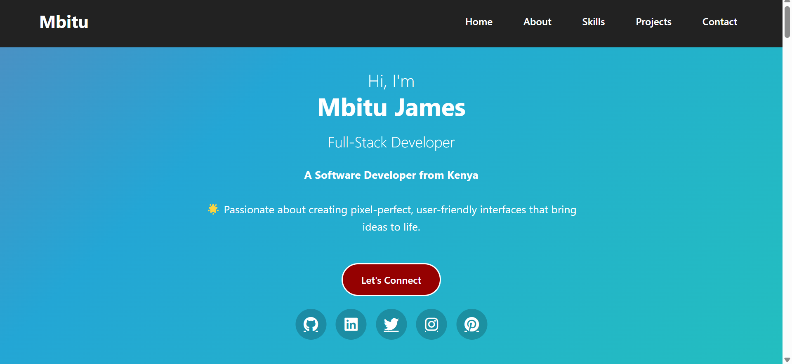

# Mbitu James - Portfolio Website



A clean, responsive portfolio website showcasing my skills, projects, and professional background as a Full-Stack Developer.

## Features

- **Modern UI Design**: Clean layout with attractive color scheme
- **Fully Responsive**: Works on all device sizes
- **Interactive Elements**: 
  - Animated progress bars for skills
  - Project filtering system
  - Interactive contact form
- **Sections**:
  - Hero section with social links
  - About me with skills tags
  - Skills with proficiency indicators
  - Education timeline
  - Project showcase
  - Contact information

## Technologies Used

- **Frontend**:
  - HTML5
  - CSS3 (Flexbox, Grid)
  - JavaScript (ES6)
- **Icons**: Font Awesome
- **Hosting**: GitHub Pages

## Color Scheme

| Color             | Hex Code   |
|-------------------|------------|
| Primary Pink      | `#e73c7e`  |
| Secondary Orange  | `#ee7752`  |
| Dark Background   | `#222`     |
| Light Background  | `#f9f9f9`  |
| Text Dark         | `#333`     |
| Text Light        | `#ffffff`  |

## Installation

No installation required! The portfolio is hosted on GitHub Pages:

🔗 [Live Demo](https://mbitujames.github.io/portfolio-plp/)

To run locally:

1. Clone the repository:
```bash
git clone https://github.com/mbitujames/portfolio-plp.git
